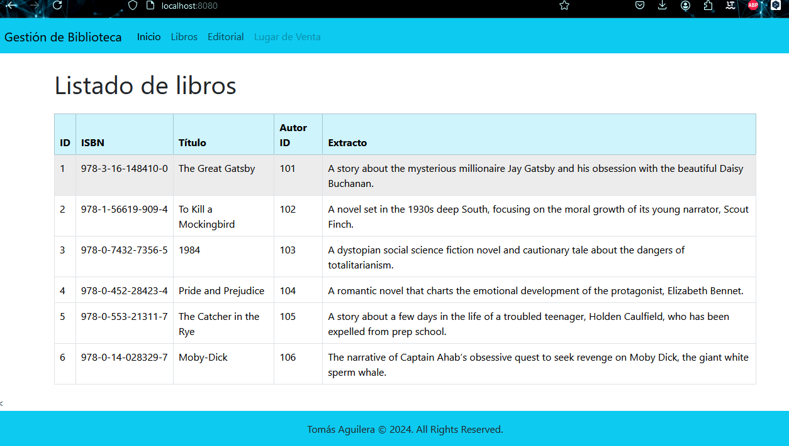

Desafío - Sistema de Gestión de Biblioteca (II)
--
En este desafío validaremos nuestros conocimientos de creación de proyectos web Spring
Boot. Para lograrlo, necesitarás aplicar todo lo aprendido en esta unidad.

Lee todo el documento antes de comenzar el desarrollo individual de este desafío, para
asegurarte de tener el máximo de puntaje y enfocar bien los esfuerzos. 
Una vez terminado el desafío, comprime la carpeta que contiene el desarrollo de los requerimientos solicitados y
sube el .zip en el LMS o envía el link del repositorio en Github.

Descripción
-
Proyecto Sistema de Gestión de Biblioteca.
Debido a la creciente demanda de una solución tecnológica eficaz para bibliotecas, se ha
solicitado el desarrollo de un sistema de gestión de biblioteca avanzado. 
La empresa de software ha sido nuevamente contratada para actualizar y mejorar el software existente, con
el objetivo de implementarlo en bibliotecas de todo el país.

En este desafío, tu tarea es continuar con la aplicación web utilizando Spring Boot para
administrar una biblioteca digital. 
La aplicación debe permitir a los usuarios explorar un catálogo de libros, realizar búsquedas por título o autor, solicitar préstamos y registrar las
devoluciones de manera efectiva. Es esencial demostrar tu dominio en el uso de anotaciones y la inyección de dependencias en el marco de Spring.

Se espera que la aplicación muestre una lista estática de libros en pantalla y que siga las
mejores prácticas de codificación y diseño de software para garantizar un producto robusto
y fácil de usar. 
Recuerda que el objetivo principal es crear una experiencia fluida para los
usuarios finales mientras gestionan sus préstamos de libros de manera eficiente.

Requerimientos
--
Debes continuar con el desarrollo del desafío anterior, ahora debes realizar:

1. Implementación de Controllers (2.5 Puntos)

   a. Crea controladores para manejar las operaciones de búsqueda de libros,
      préstamos, devoluciones y consultas de historial de préstamos.
   
   b. Aplica las mejores prácticas en el diseño de los controladores.

2. Gestión del Catálogo de Libros (2.5 Puntos)

   a. Implementa una funcionalidad para agregar nuevos libros al catálogo.
   b. Permite a los usuarios buscar libros por título o autor y mostrar los resultados
   de la búsqueda.

3. Gestión de Préstamos y Devoluciones (2.5 Puntos)
   a. Permite a los usuarios solicitar préstamos de libros disponibles en la
   biblioteca.
   b. Implementa una funcionalidad para registrar la devolución de libros
   prestados.
   c. Controla el estado de disponibilidad de los libros en préstamo.

4. Interfaz de Usuario con Thymeleaf (2.5 Puntos)
   a. Crea vistas utilizando Thymeleaf para mostrar el catálogo de libros, los
   resultados de búsqueda, los formularios de préstamo y devolución, y el
   historial de préstamos de los usuarios.
   b. Diseña una interfaz de usuario intuitiva y fácil de usar.

¡Mucho éxito!

   Consideraciones y recomendaciones
1. Se puede apoyar de los ejercicios vistos en unidades anteriores a modo de
   consulta.
2. Debes recordar el uso de anotaciones, y la inyección de dependencias.

Imagen del Proyecto Realizado

 